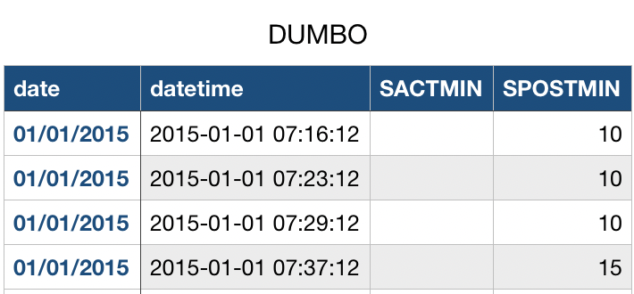
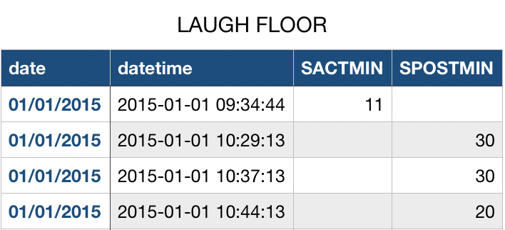
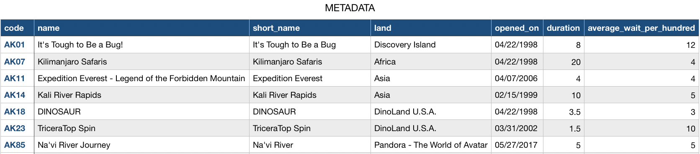

# Proposal

## Research topic

Many visitors complained about the waiting time at [Disneyland](https://disneyworld.disney.go.com/destinations/magic-kingdom/?ef_id=CjwKCAjw5P2aBhAlEiwAAdY7dJg0LgeBBf-uobxXwO-c_Zg9VLJWKVX7xoWwNrvy9iFsCvZRufvLfBoCDOEQAvD_BwE:G:s&s_kwcid=AL!5060!3!590827088345!e!!g!!magic%20kingdom%20theme%20park%20disney%20world&CMP=KNC-FY23_WDW_TRA_DXF_W365_TKT_TCKC_Tickets_EVRGRN_MKParks-Exact|G|5231013.RR.AM.01.01|M5JMF0M|BR|590827088345&keyword_id=kwd-830944659787|dc|magic%20kingdom%20theme%20park%20disney%20world|590827088345|e|5060:3|&gclid=CjwKCAjw5P2aBhAlEiwAAdY7dJg0LgeBBf-uobxXwO-c_Zg9VLJWKVX7xoWwNrvy9iFsCvZRufvLfBoCDOEQAvD_BwE). It is possible to wait in line for 6 hours to take a ride ([Source](https://www.disneydining.com/one-disney-world-attraction-saw-a-6-hour-wait-over-the-weekend-hint-its-not-even-a-brand-new-ride-bb1/)). In this project, we are interested in exploring the waiting time at the Disney Magic Kingdom to gain some insights into the general trends and patterns. Moreover, we hope the patterns discovered can help visitors plan their trip wisely to avoid waiting in long lines and enjoy as many attractions as possible in a limited time. In the future, our project can facilitate finding specific hypotheses for further supervised machine-learning studies predicting the waiting time of each attraction.

Disney provides an app showing the waiting time for each attraction, but it does not reflect historical data to show the trend. We focus on exploring the waiting times from a larger picture perspective and show how the time varies daily, monthly, and annually. We will also create some graphs to visualize the data and illustrate trends and patterns.

## Data availability

The data comes from [Touringplans.com]([https://touringplans.com/walt-disney-world/crowd-calendar#DataSets]). The data includes the most recent daily or hourly average waiting time for some selected attractions in the Magic Kingdom of Disney and the metadata that are useful for conducting analysis.

As described in the website, the data is collected directly from 3 sources:

1. from app users of [Touringplans.com]([https://touringplans.com/walt-disney-world/crowd-calendar#DataSets])
2. [Disney’s My Disney Experience app](https://disneyworld.disney.go.com/plan/my-disney-experience/?ef_id=CjwKCAjw5P2aBhAlEiwAAdY7dIkqzaELf-qklZ0q5Yby8vqX2Yxy38GD99jYgCp2JARCUI_u3nHwWxoCGRMQAvD_BwE:G:s&s_kwcid=AL!5060!3!601187705510!p!!g!!disney%20experience&CMP=KNC-FY23_WDW_TRA_DXF_W365_SCP_MYDX_MDX_Exact|G|5231013.RR.AM.01.01|MWNOQXO|BR|601187705510&keyword_id=aud-300113739056:kwd-2901498835|dc|disney%20experience|601187705510|p|5060:3|&gclid=CjwKCAjw5P2aBhAlEiwAAdY7dIkqzaELf-qklZ0q5Yby8vqX2Yxy38GD99jYgCp2JARCUI_u3nHwWxoCGRMQAvD_BwE)
3. observation from the staffs of [Touringplans.com]([https://touringplans.com/walt-disney-world/crowd-calendar#DataSets]) on sights.

As for its availability, the data can be downloaded directly from the website for free in CSV format. A CSV document downloaded contains all wait time data for a specific attraction. The wait time is recorded at different time intervals (every 1 ~ 10 minutes) for each day. For example, the raw data for attraction [Dumbo](https://disneyworld.disney.go.com/attractions/magic-kingdom/dumbo-the-flying-elephant/) and [Laugh Floor](https://disneyworld.disney.go.com/attractions/magic-kingdom/monsters-inc-laugh-floor/) are displayed below.

<!-- 
 -->
<!-- 
<!-- {width=40%} {width=40%} -->
<!--  -->
<!-- 
 -->

&nbsp;
&nbsp;

<figcaption style="text-align: center;">Fig. 1: Example Data for Dumbo (left) and Laugh Floor (right)</figcaption>

<!-- 
 -->

By our investigation, the data is available for each park opening day from 01/01/2015 to 12/28/2021, and the website provides data for 41 attractions in the Magic Kingdom. Furthermore, we also identified that there are many useful metadata from [Touringplans.com]([https://touringplans.com/walt-disney-world/crowd-calendar#DataSets]). For instance, we have the access to the metadata for each attraction of the Magic Kingdom, which records useful information including its unique code, duration, and where it locates. Note that information like durations are extremely helpful when analyzing the waiting time of attractions. The example dataset is displayed below.

<figcaption style="text-align: center;">Fig. 2: Example Metadata</figcaption>

In addition, we found a data dictionary from the same site, which explains the meaning of each attribute in the dataset in detail and helps us disambiguate each column. For example, the attribute **SACTMIN** stands for the "Actual Wait Time" while **SPOSTMIN** represents the "Standby Post Wait Time". As for our plan of importing data, we will manually download all source CSV file (including metadata) and process them into R dataframes. During processing, we will heavily rely on the data dictionaries and metadata that we mentioned before to decide which columns and rows are important. We will also transfer metadata into R dataframe and combine that with all source files. New statistics will be computed if necessary. With all of these source data and metadata, our analysis and envisionment mentioned in the preceding section are feasible.
